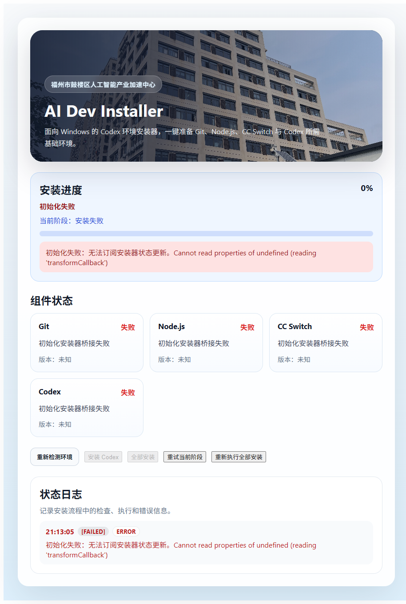
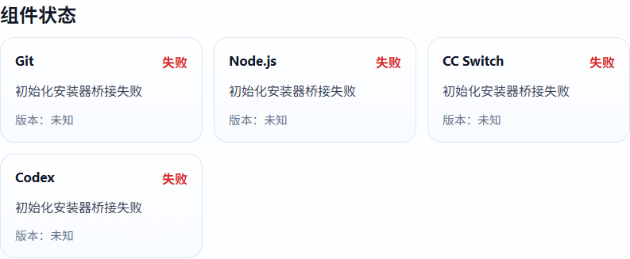

# AI Dev Installer

`AI Dev Installer` 是一个面向 Windows 的一键部署器，用来把运行 Codex、Claude Code 所需的基础环境一次准备好。

它把环境检测、依赖安装、状态展示和失败重试放进一个桌面应用里，目标是让用户不必手动逐个安装 Git、Python、Node.js、CC Switch，再自己排查 PATH 和权限问题。

适合这几类场景：

- 新机器第一次配置 AI 开发环境
- 希望统一安装 Codex 与 Claude Code
- 不想手动处理 PATH、权限和基础依赖

## 快速开始

1. 下载最新的 Windows 安装包 `AI Dev Installer_0.1.0_x64-setup.exe`
2. 安装后以管理员身份启动应用
3. 按需要点击 `安装 Codex`、`安装 Claude Code` 或 `全部安装`
4. 等待界面完成最终校验

## 功能

- 一键检测本机是否已具备 Codex 所需基础环境
- 静默安装 `Git`、`Python`、`Node.js`、`CC Switch`
- 通过 `winget` 安装 `Codex`
- 通过 `npm` 安装 `Claude Code`
- 支持单独执行 `安装 Codex`、`安装 Claude Code` 或 `全部安装`
- 实时展示当前阶段、组件状态和安装日志
- 安装失败后支持重试当前阶段或重新执行全部流程
- 安装后自动刷新环境探测，尽量避免因为旧 PATH 导致必须重启电脑
- `全部安装` 中会先完成 Codex，再执行 Claude Code
- 如果 `全部安装` 中 Claude Code 失败，只会单独标记 Claude Code 失败，不会把主流程整体判定为失败

## 当前覆盖组件

| 组件 | 版本 | 说明 |
|------|------|------|
| `Git` | 2.54.0 | 代码版本管理工具 |
| `Python` | 3.12.10 | 运行环境依赖 |
| `Node.js` | 24.15.0 | JavaScript 运行环境 |
| `CC Switch` | 3.14.1 | 网络代理工具 |
| `Codex` | Latest | 通过 `winget` 安装 |
| `Claude Code` | Latest | 通过 `npm` 安装 |

## 界面预览






## 系统要求

- Windows 10/11 x64
- 管理员权限
- 可访问 `winget` / Microsoft Store

## 本地开发

### 前置条件

- Node.js 18+
- Rust 1.70+
- Tauri 2 CLI

### 安装依赖

```bash
npm install
```

### 开发模式

```bash
npm run tauri dev
```

### 运行测试

```bash
npm run test
cargo test --manifest-path src-tauri/Cargo.toml
```

### 构建安装包

```bash
npm run tauri build
```

构建产物默认位于：

```text
src-tauri/target/release/bundle/nsis/
```

## 项目结构

```text
ai-dev-installer/
├── src/                # React 前端
├── src-tauri/          # Rust + Tauri 后端
├── docs/               # 安装说明与截图
├── package.json
└── README.md
```

## 技术栈

- React 18
- TypeScript
- Vite
- Rust
- Tauri 2
- SQLite (`rusqlite`)
- Windows Credential Manager (`keyring`)

## 说明

- 第三方安装包资源不全部随 Git 仓库分发
- `src-tauri/resources/third_party/manifest.json` 负责记录资源版本和校验信息
- 若补齐第三方资源并执行打包，可生成完整 Windows 安装器

## License

MIT
